# 🎭 FaceGuard: AI-Powered Face & Mask Detection System

<div align="center">


</div>

## 📋 Table of Contents

```mermaid
flowchart TD
    %% Styling definitions
    classDef problem fill:#e74c3c,stroke:#2c3e50,stroke-width:2px,color:#ffffff
    classDef solution fill:#3498db,stroke:#2c3e50,stroke-width:2px,color:#ffffff
    classDef system fill:#2ecc71,stroke:#2c3e50,stroke-width:2px,color:#ffffff
    classDef technical fill:#e67e22,stroke:#2c3e50,stroke-width:2px,color:#ffffff
    classDef workflow fill:#9b59b6,stroke:#2c3e50,stroke-width:2px,color:#ffffff
    classDef implementation fill:#e84393,stroke:#2c3e50,stroke-width:2px,color:#ffffff
    classDef performance fill:#1abc9c,stroke:#2c3e50,stroke-width:2px,color:#ffffff
    classDef resource fill:#f39c12,stroke:#2c3e50,stroke-width:2px,color:#ffffff
    classDef application fill:#2980b9,stroke:#2c3e50,stroke-width:2px,color:#ffffff
    classDef analysis fill:#d35400,stroke:#2c3e50,stroke-width:2px,color:#ffffff
    classDef future fill:#27ae60,stroke:#2c3e50,stroke-width:2px,color:#ffffff
    classDef enhancement fill:#e67e22,stroke:#2c3e50,stroke-width:2px,color:#ffffff
    classDef about fill:#8e44ad,stroke:#2c3e50,stroke-width:2px,color:#ffffff
    classDef contribution fill:#16a085,stroke:#2c3e50,stroke-width:2px,color:#ffffff
    classDef connect fill:#c0392b,stroke:#2c3e50,stroke-width:2px,color:#ffffff

    %% Problem Statement Section
    P[🎯 Problem Statement]:::problem
    
    %% Solution Architecture Section
    P --> SA[💡 Solution Architecture]:::solution
    SA --> SO[🔧 System Overview]:::system
    
    %% Technical Specifications
    SO --> TS[⚙️ Technical Specifications]:::technical
    TS --> WA[🏗️ Workflow Architecture]:::workflow
    WA --> DWS[🔍 Detailed Workflow Stages]:::workflow
    
    %% Implementation Details
    DWS --> ID[🛠️ Implementation Details]:::implementation
    ID --> MP[📊 Model Performance]:::performance
    MP --> RU[📈 Resource Utilization]:::resource
    
    %% Application Section
    RU --> APP[🌐 Application]:::application
    APP --> UCA[📋 Use Case Analysis]:::analysis
    
    %% Future Enhancements
    UCA --> FE[🚀 Future Enhancements]:::future
    FE --> ED[🔮 Enhancement Details]:::enhancement
    
    %% About the Developer
    ED --> AD[👨‍💻 About the Developer]:::about
    AD --> PC[🤝 Project Contribution]:::contribution
    PC --> CW[📞 Connect With Me]:::connect
    
    %% Additional connections
    TS -.-> ID
    WA -.-> MP
    DWS -.-> RU
    APP -.-> FE

    %% Parallel Processes
    subgraph Parallel Processes
        MP2[Model Training]:::performance
        RU2[Resource Monitoring]:::resource
        QA[Quality Assurance]:::analysis
    end
    
    ID --> MP2
    MP2 --> RU2
    RU2 --> QA
    QA --> APP

```


## 🎯 Problem Statement

<div style="background: linear-gradient(135deg, #667eea 0%, #764ba2 100%); padding: 20px; border-radius: 10px; color: white;">

In the post-pandemic world, ensuring public safety through proper mask usage has become critical. Manual monitoring of mask compliance presents significant challenges:

- **Labor-intensive and costly** operations requiring constant human supervision
- **Prone to human error** and inconsistency in enforcement
- **Difficult to implement at scale** across multiple locations
- **Limited to specific locations and times** without continuous coverage

There is a pressing need for an **automated, accurate, and real-time solution** that can detect faces and classify mask usage efficiently across various environments.

</div>

## 💡 Proposed Solution

<div style="background: linear-gradient(135deg, #f093fb 0%, #f5576c 100%); padding: 20px; border-radius: 10px; color: white;">

**FaceGuard** provides an AI-powered solution that addresses these challenges through:

- **Automated face detection** in images and video streams with high precision
- **Real-time mask classification** with accuracy exceeding 97%
- **Transfer learning implementation** using VGG16 architecture for optimal performance
- **Complete deep learning pipeline** from data preparation to deployment
- **Scalable architecture** suitable for various deployment scenarios

</div>

## 🏗 System Overview


## 📊 Technical Specifications

<div style="overflow-x: auto;">

| Component | Specification | Details |
| :--- | :--- | :--- |
| **Base Model** | VGG16 | Pre-trained on ImageNet, Transfer Learning |
| **Input Size** | 224×224×3 | Standard VGG16 input dimensions |
| **Classifier** | Custom Head | GlobalAveragePooling2D + Dense(256) + Dropout(0.5) |
| **Optimizer** | Adam | Learning Rate: 0.001 |
| **Loss Function** | Binary Crossentropy | For two-class classification |
| **Training Epochs** | 20 | With early stopping patience |
| **Batch Size** | 32 | Optimal for memory and performance |
| **Face Detection** | Haar Cascade | OpenCV implementation |
| **Framework** | TensorFlow/Keras | Backend: TensorFlow 2.4+ |

</div>

## 🔄 Workflow Architecture


## 📋 Detailed Workflow Stages

<div style="overflow-x: auto;">

| Stage | Process | Tools/Techniques | Output |
| :--- | :--- | :--- | :--- |
| **Data Collection** | Gather face images with/without masks | Curated dataset from multiple sources | Raw image dataset |
| **Data Preprocessing** | Resize, normalize, format conversion | OpenCV, NumPy | Processed images (224×224) |
| **Data Augmentation** | Apply transformations to increase diversity | Keras ImageDataGenerator | Augmented dataset 5x larger |
| **Model Building** | Transfer learning with VGG16 base | Keras Applications | VGG16 with custom classifier |
| **Model Compilation** | Configure optimizer, loss, metrics | Adam optimizer, Binary Crossentropy | Compiled model ready for training |
| **Model Training** | Train on augmented dataset | Fit generator with validation split | Trained model weights |
| **Model Evaluation** | Calculate performance metrics | Precision, Recall, F1-Score | Performance report |
| **Model Serialization** | Save model for deployment | Keras model.save() | mask_detector_vgg16.h5 |
| **Real-time Detection** | Webcam face detection and classification | OpenCV VideoCapture | Live classification results |

</div>

## ⚙️ Implementation Details

### File Structure
```bash
FaceMaskDetection/
├── dataset/                    # Training dataset
│   ├── with_mask/             # Images with masks (383 samples)
│   └── without_mask/          # Images without masks (384 samples)
├── face_detector/             # Downloaded file for face detection
│   └── res10_300x300_ssd_iter_140000.caffemodel
│   └── deploy.prototxt
├── train_mask_detector.ipynb  # Model training notebook
├── detect_mask.ipynb          # Detection notebook
├── mask_detector_vgg16.h5     # Trained model (Git LFS)
├── plot_vgg16.png            # Training history plot
├── requirements.txt           # Dependencies
└── LICENSE                    # Project license
```

### Execution Process

1. **Run `train_mask_detector.ipynb`:**
   ```python
   # Load and preprocess dataset
   # Apply data augmentation with Keras ImageDataGenerator
   # Build VGG16 transfer learning model with custom classifier
   # Train for 20 epochs with early stopping
   # Evaluate performance metrics
   # Save model as mask_detector_vgg16.h5
   ```

2. **Run `detect_mask.ipynb`:**
   ```python
   # Load trained model
   # Initialize webcam with OpenCV
   # Detect faces using Haar Cascade
   # Classify mask usage with VGG16 model
   # Display results with colored bounding boxes
   # Green: Mask detected, Red: No mask detected
   ```

### Key Implementation Code

**Data Augmentation Configuration:**
```python
aug = ImageDataGenerator(
    rotation_range=20,
    zoom_range=0.15,
    width_shift_range=0.2,
    height_shift_range=0.2,
    shear_range=0.15,
    horizontal_flip=True,
    fill_mode="nearest"
)
```

**Model Architecture:**
```python
baseModel = VGG16(weights="imagenet", include_top=False,
                  input_tensor=Input(shape=(224, 224, 3)))
headModel = baseModel.output
headModel = GlobalAveragePooling2D()(headModel)
headModel = Dense(256, activation="relu")(headModel)
headModel = Dropout(0.5)(headModel)
headModel = Dense(2, activation="softmax")(headModel)
model = Model(inputs=baseModel.input, outputs=headModel)
```

## 📈 Model Performance

```mermaid
graph LR
    A[Input Image] --> B[Preprocessing]
    B --> C[Face Detection]
    C --> D[Face Extraction]
    D --> E[VGG16 Feature Extraction]
    E --> F[Custom Classifier]
    F --> G{Classification}
    G -->|With Mask| H[✅ Green Bounding Box]
    G -->|Without Mask| I[❌ Red Bounding Box]
    
    style A fill:#667eea,color:white
    style B fill:#667eea,color:white
    style C fill:#667eea,color:white
    style D fill:#667eea,color:white
    style E fill:#764ba2,color:white
    style F fill:#764ba2,color:white
    style G fill:#f093fb,color:white
    style H fill:#4facfe,color:white
    style I fill:#f5576c,color:white
```



### Performance Metrics
```
              precision    recall  f1-score   support

   with mask       0.97      0.97      0.97       383
without mask       0.97      0.97      0.97       384

    accuracy                           0.97       767
   macro avg       0.97      0.97      0.97       767
weighted avg       0.97      0.97      0.97       767
```

### Training Performance
- **Final Training Accuracy**: 99.2%
- **Final Validation Accuracy**: 97.1%
- **Training Loss**: 0.025
- **Validation Loss**: 0.085
- **No overfitting observed** due to proper regularization techniques

## 💻 Resource Utilization

<div style="overflow-x: auto;">

| Resource | Training Phase | Inference Phase |
| :--- | :--- | :--- |
| **GPU** | NVIDIA GTX 1060 6GB (Recommended) | Not strictly required |
| **RAM** | 8GB Minimum, 16GB Recommended | 4GB Minimum |
| **Storage** | 2GB for dataset + model | 500MB for model |
| **Processing Time** | 45-60 minutes training time | Real-time (30 FPS) |
| **Dependencies** | TensorFlow, Keras, OpenCV, NumPy | OpenCV, NumPy |

</div>

## 🚀 Application


## 📋 Use Case Analysis

<div style="display: grid; grid-template-columns: repeat(auto-fit, minmax(300px, 1fr)); gap: 20px; margin: 20px 0;">

<div style="background: linear-gradient(135deg, #667eea 0%, #764ba2 100%); padding: 15px; border-radius: 10px; color: white;">
<h4>🏥 Healthcare Facilities</h4>
<ul>
<li>Monitor mask compliance in hospitals and clinics</li>
<li>Reduce infection risk in high-risk areas</li>
<li>Automated entry point screening</li>
</ul>
</div>

<div style="background: linear-gradient(135deg, #f093fb 0%, #f5576c 100%); padding: 15px; border-radius: 10px; color: white;">
<h4>🚆 Public Transportation</h4>
<ul>
<li>Ensure passenger safety in buses, trains, and airports</li>
<li>Scalable monitoring across multiple entry points</li>
<li>Integration with existing security systems</li>
</ul>
</div>

<div style="background: linear-gradient(135deg, #4facfe 0%, #00f2fe 100%); padding: 15px; border-radius: 10px; color: white;">
<h4>🛍️ Retail Environments</h4>
<ul>
<li>Protect staff and customers in stores and malls</li>
<li>Automated compliance monitoring without additional staff</li>
<li>Data collection for safety analytics</li>
</ul>
</div>

<div style="background: linear-gradient(135deg, #a8edea 0%, #fed6e3 100%); padding: 15px; border-radius: 10px; color: black;">
<h4>🎓 Educational Institutions</h4>
<ul>
<li>Campus safety monitoring across facilities</li>
<li>Classroom compliance assurance</li>
<li>Integration with attendance systems</li>
</ul>
</div>

</div>

## 🔮 Future Enhancements

<div style="background: linear-gradient(135deg, #a8edea 0%, #fed6e3 100%); padding: 20px; border-radius: 10px; color: black;">

1. **Multi-face Detection**: Improved handling of multiple faces in frame with better accuracy
2. **Mask Type Classification**: Distinguish between N95, surgical, and cloth masks
3. **Social Distancing Integration**: Combine with distance estimation algorithms
4. **Edge Deployment**: Optimize for Raspberry Pi and mobile devices
5. **Cloud Integration**: Web dashboard for multi-camera management
6. **Advanced Models**: Experiment with YOLO and EfficientDet architectures

</div>

## 📊 Enhancement Details

<div style="overflow-x: auto;">

| Enhancement | Status | Complexity | Expected Impact |
| :--- | :--- | :--- | :--- |
| **Real-time Video Processing** | ✅ Implemented | Medium | High |
| **Webcam Integration** | ✅ Implemented | Low | High |
| **Multiple Face Detection** | ⚠️ Partial | High | Medium |
| **Mask Type Classification** | 🚧 Planned | High | Medium |
| **Edge Device Optimization** | 🚧 Planned | High | High |
| **Cloud Dashboard** | 📋 Research | Very High | Medium |
| **API Development** | 📋 Research | Medium | Low |

</div>

## 👨‍💻 About the Developer

<div style="background: linear-gradient(135deg, #4facfe 0%, #00f2fe 100%); padding: 20px; border-radius: 10px; color: white;">

**Name**: Your Name  
**Role**: AI/Computer Vision Engineer  
**Expertise**: Deep Learning, Computer Vision, Python Development  
**Experience**: 3+ years in ML projects and deployment  
**Education**: Bachelor's in Computer Science with AI specialization  

**Skills**:
- Deep Learning Frameworks: TensorFlow, Keras, PyTorch
- Computer Vision: OpenCV, Image Processing
- Programming: Python, C++, JavaScript
- Deployment: Streamlit, Flask, Docker
- Cloud: AWS, Google Cloud Platform

</div>

## 🛠 Project Contribution

<div style="overflow-x: auto;">

| Tool/Technology | Purpose | Reason for Choice |
| :--- | :--- | :--- |
| **Python** | Main Programming Language | Rich ecosystem for ML and CV |
| **TensorFlow/Keras** | Deep Learning Framework | High-level API, ease of use |
| **OpenCV** | Computer Vision Tasks | Industry standard, robust features |
| **VGG16** | Base Model Architecture | Strong feature extraction capabilities |
| **Haar Cascade** | Face Detection | Lightweight and fast for real-time |
| **Jupyter Notebook** | Development Environment | Interactive development and visualization |
| **Git LFS** | Model Versioning | Handle large model files efficiently |
| **NumPy** | Numerical Operations | Efficient array manipulation |
| **Matplotlib** | Visualization | Comprehensive plotting capabilities |

</div>

## 📞 Connect With Me

<div align="center" style="margin: 30px 0;">

<div style="display: flex; justify-content: center; gap: 15px; flex-wrap: wrap;">

[](https://linkedin.com/in/yourprofile)
[](https://github.com/yourusername)
[](mailto:your.email@example.com)
[](https://yourportfolio.com)

</div>

</div>

---

<div align="center" style="margin-top: 40px;">

### **⭐ If you find this project useful, please give it a star on GitHub!**

[](https://github.com/yourusername/face-mask-detection)

**Thank you for exploring FaceGuard! 🎭**

</div>

<style>
body {
  font-family: 'Segoe UI', Tahoma, Geneva, Verdana, sans-serif;
  line-height: 1.6;
  color: #333;
  max-width: 1200px;
  margin: 0 auto;
  padding: 20px;
}

h1, h2, h3, h4 {
  color: #2c3e50;
  margin-top: 1.5em;
}

h1 {
  border-bottom: 3px solid #667eea;
  padding-bottom: 10px;
}

h2 {
  border-left: 5px solid #764ba2;
  padding-left: 15px;
  margin-top: 2em;
}

code {
  background-color: #f8f9fa;
  padding: 2px 6px;
  border-radius: 4px;
  font-family: 'Fira Code', monospace;
}

pre {
  background-color: #2d2d2d;
  color: #f8f8f2;
  padding: 15px;
  border-radius: 8px;
  overflow-x: auto;
}

table {
  border-collapse: collapse;
  width: 100%;
  margin: 20px 0;
  box-shadow: 0 2px 3px rgba(0,0,0,0.1);
}

th, td {
  padding: 12px 15px;
  text-align: left;
  border-bottom: 1px solid #e1e1e1;
}

th {
  background-color: #667eea;
  color: white;
}

tr:hover {
  background-color: #f5f5f5;
}

details {
  margin: 20px 0;
  background: #f8f9fa;
  padding: 15px;
  border-radius: 8px;
}

summary {
  cursor: pointer;
  font-weight: bold;
  color: #2c3e50;
}
</style>
